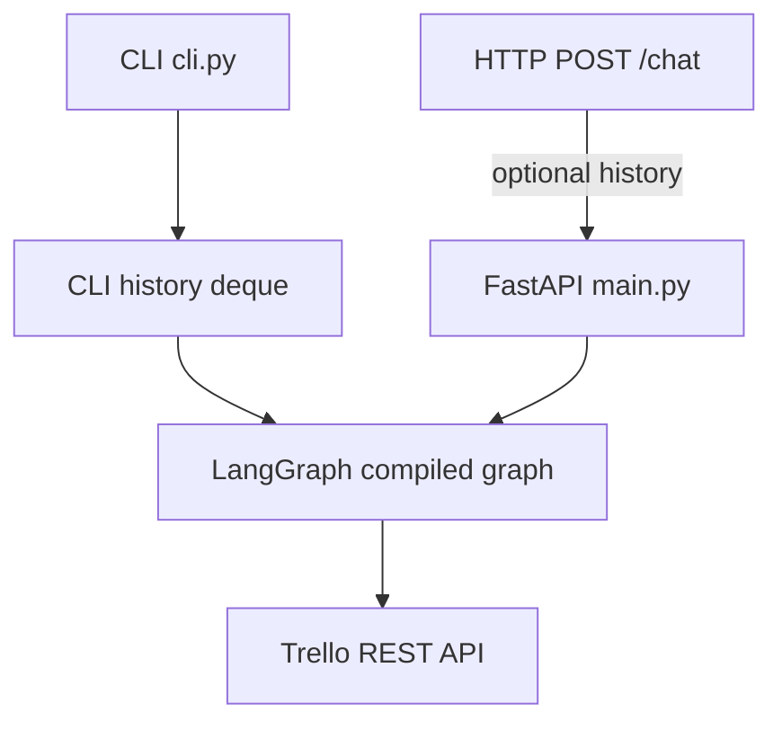
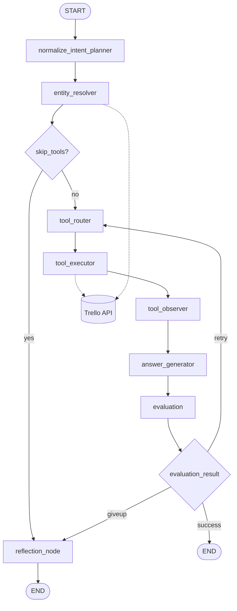

# Trello AI Agent (LangGraph + FastAPI)

Production-style agent that maps natural language to **Trello REST** calls (`get_boards`, `get_lists`, `get_cards`, `get_board_cards` for all lists on a board, `get_card_details` for one card’s description, labels, due/start dates, checklists, and members, `create_card`, `update_card`, `move_card`, optional `delete_card`) using **LangGraph** and **OpenAI** (`MODEL` in `.env`, e.g. `gpt-4.1`).

**Deleting cards** is controlled by **`DELETE_ITEM`** in `.env` (default `false`). When disabled, delete requests are blocked with an explanation; set `DELETE_ITEM=true` to allow `DELETE /1/cards/{id}`.

## Setup

```bash
cd trello_agent
python -m venv .venv
.venv\Scripts\activate   # Windows
# source .venv/bin/activate   # Linux / WSL
pip install -r requirements.txt
```

### WSL and slow imports

- **Use this project’s venv**, not another repo’s (e.g. `homepage/chatbot/.venv`). If `python3` resolves to a different environment, you will pull unrelated heavy packages (e.g. `transformers`) and imports can hang for a long time.
- **Create and activate `.venv` inside `trello_agent`** before running `cli.py` or `uvicorn`.
- Code on **`/mnt/c/...` (Windows drives from WSL)** is slower for many small Python files than a native Linux filesystem. For daily work, clone or copy the project under `~/` in WSL if startup is still slow.
- The CLI shows the `>` prompt **immediately**; LangGraph and models load on the **first real message** (one-time cost). You will see a short “Loading agent…” line then — **10–60s** on WSL + `/mnt/c` is common for that first load.
- Each turn runs the **planner LLM** plus **answer LLM** (and **reflection** on failure). A failed run no longer retries the same routing error three times, but the first successful turn after cold start still pays the import + model cost once.
- **First message / cold start:** structured progress is logged to **stderr** with the prefix **`[startup]`** (LangGraph import steps, `graph.compile`, first `graph.invoke`, first `ChatOpenAI` construction). Your REPL answer still prints on stdout; watch the same terminal for stderr, or run with `python cli.py --verbose` to raise **`app.*`** loggers to DEBUG.

When **`TRELLO_BOARD_ID`** is set but **`BOARD_SCOPE_ONLY=false`**, the resolver still defaults to that board if you do not name one — but if your message **mentions** another board by name (e.g. “Notes GA”, “Welcome Board”), it **detects** that name from the question and queries that board so answers stay in sync (not “one turn behind” the wrong board).

Create `.env` (do not commit secrets):

```env
TRELLO_TOKEN=...
TRELLO_KEY=...          # or TRELOO_KEY (typo tolerated)
TRELLO_BOARD_ID=...     # optional: default board; when set, single-board mode is on by default
BOARD_SCOPE_ONLY=true   # optional: default true if TRELLO_BOARD_ID is set — only that board is listed/used
API_KEY=...             # OpenAI key
MODEL=gpt-4.1
DELETE_ITEM=false       # set true to allow delete_card (permanent card deletion)
```

With **`TRELLO_BOARD_ID`** set and **`BOARD_SCOPE_ONLY=true`** (the default in that case):

- **`get_boards`** returns only that board.
- All list/card actions use that board; asking for another board by name returns an error.
- Set **`BOARD_SCOPE_ONLY=false`** if you still want to browse other boards while keeping **`TRELLO_BOARD_ID`** as the default when no board is named.

## Run API

```bash
cd trello_agent
uvicorn main:app --reload --host 0.0.0.0 --port 8000
```

### `POST /chat` (stateless)

Optional fields: `auth` (reserved, ignored in MVP), `history` (client-managed prior turns), `id` (UUID echoed back).

```bash
curl -s -X POST http://127.0.0.1:8000/chat ^
  -H "Content-Type: application/json" ^
  -d "{\"question\": \"List my boards\", \"history\": []}"
```

Example body:

```json
{
  "question": "List my boards",
  "auth": null,
  "history": ["user: hi", "assistant: Hello!"],
  "id": "3fa85f64-5717-4562-b3fc-2c963f66afa6"
}
```

### `GET /health`

Liveness check.

## Run CLI (REPL)

From the **parent** of `trello_agent` (so Python can resolve the package):

```bash
cd path\to\Documents
python -m trello_agent.cli --trace
```

Or from **inside** `trello_agent`:

```bash
cd trello_agent
python cli.py --trace
python cli.py --verbose   # DEBUG for app.* on stderr (more startup detail)
```

Commands: `/quit`, `/reset`, `/history`, `/trace on|off`.

CLI keeps **in-process** history and appends JSONL lines to `trello_agent/logs/cli_history.log` (for replay/training). The HTTP API does **not** use this file.

## Example prompts (intents)

| Intent | Example |
|--------|---------|
| get_boards | “What boards do I have?” |
| get_lists | “Show lists on my board” (uses `TRELLO_BOARD_ID` or name) |
| get_cards | “List cards in To Do on this board” (one list) |
| get_board_cards | “Show every card on the board” / “all cards in there” (all lists) |
| get_card_details | “Show me the Ai card” / “What’s the description and checklist on card X?” (one card; name matched on the board) |
| create_card | “Create a card ‘Buy milk’ in To Do” |
| update_card | “Set description of card X to …” |
| move_card | “Move card X to Done” |
| delete_card | “Delete card X” (requires `DELETE_ITEM=true`) |

Board/list names are resolved case-insensitively. Set `TRELLO_BOARD_ID` when you want a default board without naming it every time.

## Architecture

### System overview

The HTTP API is **stateless** (optional `history` in each request). The CLI keeps its own in-memory history and optional JSONL log; both paths invoke the same compiled LangGraph.



### LangGraph topology

Nodes live under `app/graph.py` and `app/nodes/`. Flow: plan intent and entities, resolve names to Trello IDs, route to the right REST call, execute, normalize the response, generate a natural-language answer, then evaluate. On **success** the run ends; on **retry** (up to `MAX_EVAL_RETRIES` in `app/config.py`) control returns to `tool_router`; on **give up** the **reflection** node produces a graceful explanation.



**Node roles (short):**

| Node | Role |
|------|------|
| `normalize_intent_planner` | LLM: intent + `entities` (JSON via structured output) |
| `entity_resolver` | Maps board/list/card names to IDs; uses `TRELLO_BOARD_ID` when appropriate |
| `tool_router` | Maps intent → Trello operation payload (`delete_card` only if `DELETE_ITEM=true`) |
| `tool_executor` | Calls `app/trello_client.py` (HTTP, timeouts, retries on 5xx) |
| `tool_observer` | Shrinks raw JSON for the answer LLM |
| `answer_generator` | LLM: user-facing reply from `parsed_response` + `question` + `history` |
| `evaluation` | HTTP / error checks; routes to retry, end, or reflection |
| `reflection_node` | LLM: explains failures when tools are skipped or max retries exceeded |

For the full product spec and state fields, see [`prd.md`](prd.md).

## Security

- Never commit `.env` or API keys.
- Rotate keys if they were exposed in a repo or chat.
- **`DELETE_ITEM`** defaults to `false`: card deletion is blocked until you set `DELETE_ITEM=true` (permanent `DELETE /cards/{id}`).
