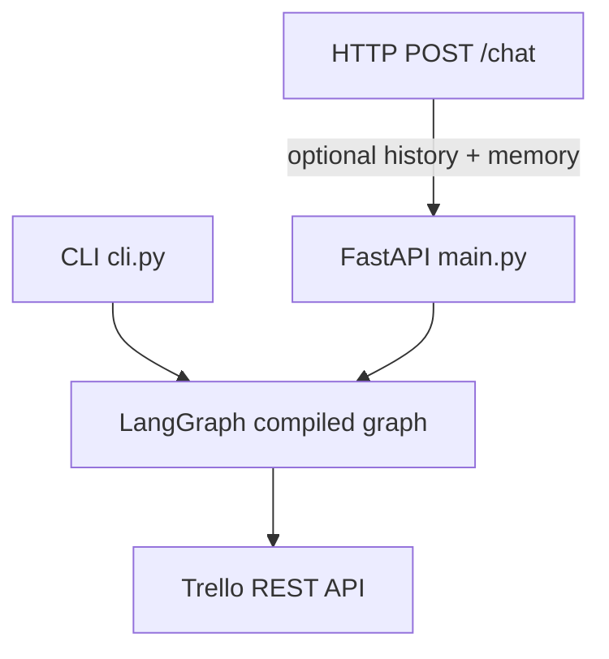
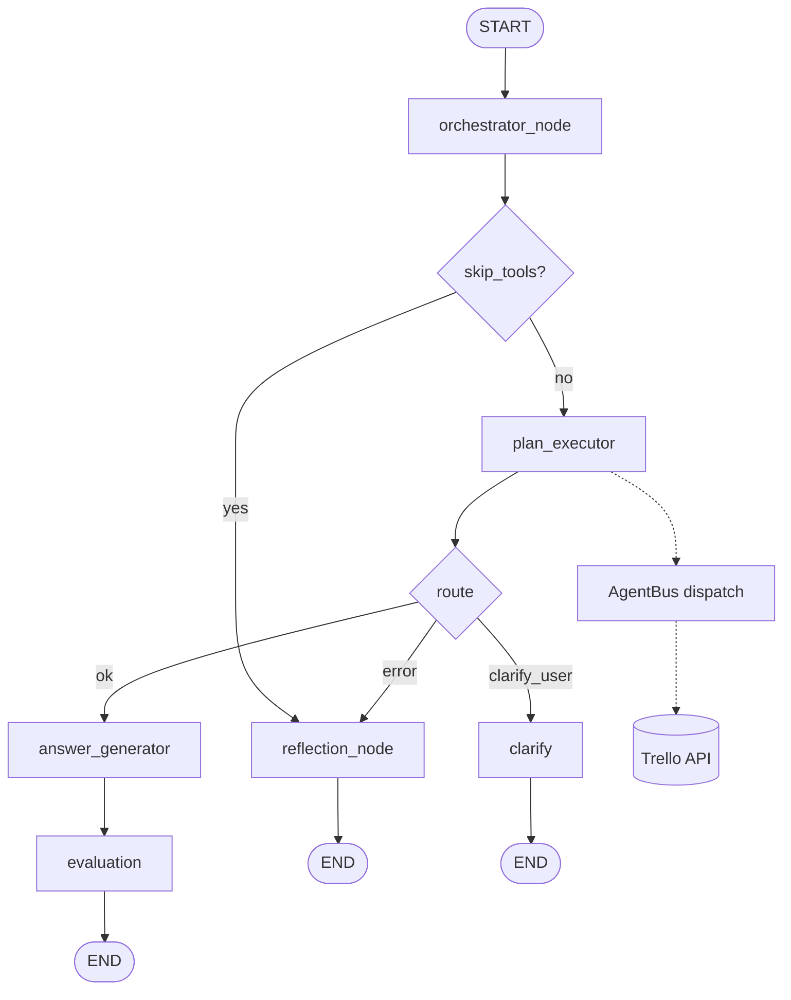

# Trello AI Agent (LangGraph + FastAPI) — PRD v2

Production-style agent that maps natural language to **Trello REST** calls across **boards, lists, cards, checklists, check items, comments, labels, members, and board actions** (`prd_v2.md`). It uses **LangGraph**, **OpenAI** (`MODEL` in `.env`, e.g. `gpt-4.1`), and a **session working memory** (CLI and optional `memory` on `POST /chat`) so follow-ups like “show me what’s under **Ai2**” resolve to the **card** Ai2 when that card appeared in the last listing.

**Deleting cards** is controlled by **`DELETE_ITEM`** in `.env` (default `false`). When disabled, delete requests are blocked with an explanation; set `DELETE_ITEM=true` to allow `DELETE /1/cards/{id}`.

## Setup

```bash
cd trello_agent
python -m venv .venv
.venv\Scripts\activate   # Windows
# source .venv/bin/activate   # Linux / WSL
pip install -r requirements.txt
```

### WSL and slow imports

- **Use this project’s venv**, not another repo’s (e.g. `homepage/chatbot/.venv`). If `python3` resolves to a different environment, you will pull unrelated heavy packages (e.g. `transformers`) and imports can hang for a long time.
- **Create and activate `.venv` inside `trello_agent`** before running `cli.py` or `uvicorn`.
- Code on **`/mnt/c/...` (Windows drives from WSL)** is slower for many small Python files than a native Linux filesystem. For daily work, clone or copy the project under `~/` in WSL if startup is still slow.
- The CLI shows the `>` prompt **immediately**; LangGraph and models load on the **first real message** (one-time cost). You will see a short “Loading agent…” line then — **10–60s** on WSL + `/mnt/c` is common for that first load.
- Each turn runs the **orchestrator LLM** (plan DAG) plus **answer LLM** (and **reflection** on failure). The first successful turn after cold start still pays the import + model cost once.
- **First message / cold start:** structured progress is logged to **stderr** with the prefix **`[startup]`** (LangGraph import steps, `graph.compile`, first `graph.invoke`, first `ChatOpenAI` construction). Your REPL answer still prints on stdout; watch the same terminal for stderr, or run with `python cli.py --verbose` to raise **`app.*`** loggers to DEBUG.

When **`TRELLO_BOARD_ID`** is set but **`BOARD_SCOPE_ONLY=false`**, the resolver still defaults to that board if you do not name one — but if your message **mentions** another board by name (e.g. “Notes GA”, “Welcome Board”), it **detects** that name from the question and queries that board so answers stay in sync (not “one turn behind” the wrong board).

Create `.env` (do not commit secrets):

```env
TRELLO_TOKEN=...
TRELLO_KEY=...          # or TRELOO_KEY (typo tolerated)
TRELLO_BOARD_ID=...     # optional: default board; when set, single-board mode is on by default
BOARD_SCOPE_ONLY=true   # optional: default true if TRELLO_BOARD_ID is set — only that board is listed/used
API_KEY=...             # OpenAI key
MODEL=gpt-4.1
DELETE_ITEM=false       # set true to allow delete_card (permanent card deletion)

# Optional — stderr logging (see Observability below)
# LOG_TRELLO_FULL=false
# LOG_LLM_FULL=false
# LOG_MAX_BODY_CHARS=16000
```

### Observability (stderr)

Every **Trello** call logs one **`[trello]`** line at **INFO**: method, path, HTTP status, duration, approximate JSON size, and list length or top-level dict keys. Set **`LOG_TRELLO_FULL=true`** in `.env` to also log full request JSON (for `POST`/`PUT`) and response bodies (truncated to **`LOG_MAX_BODY_CHARS`**).

Every **LLM** step logs **`[llm]`** at **INFO**: operation name (`orchestrator_build_plan`, `orchestrator_resume_plan`, `answer_agent`, `reflection_agent`, …), model, duration, and response size. Set **`LOG_LLM_FULL=true`** to log full prompts and responses (truncated). OpenAI’s **`httpx`** lines may still appear separately for the raw HTTP call.

**Agent-to-agent (A2A)** dispatch logs **`[a2a]`** at **INFO**: `dispatch` (task, from, to, ask) and `reply` (status, data keys, duration). Plan lifecycle logs **`[plan]`**: built plan id + step list, resume hints.

Use **`python cli.py --verbose`** so **`app.*`** loggers emit **DEBUG** (e.g. extra query param detail on Trello).

With **`TRELLO_BOARD_ID`** set and **`BOARD_SCOPE_ONLY=true`** (the default in that case):

- **`get_boards`** returns only that board.
- All list/card actions use that board; asking for another board by name returns an error.
- Set **`BOARD_SCOPE_ONLY=false`** if you still want to browse other boards while keeping **`TRELLO_BOARD_ID`** as the default when no board is named.

## Session memory

After each successful turn, the graph updates **`memory`**: `board_id`, `board_name`, `list_map`, **`last_cards`**, **`last_card_id`**, optional **`pending_clarify`**, and **`pending_plan`** (serialized Plan DAG) when the user must answer a clarification — the next turn **resumes** that plan via `orchestrator_resume_plan` instead of replanning from scratch.

## Run API

```bash
cd trello_agent
uvicorn main:app --reload --host 0.0.0.0 --port 8000
```

### `POST /chat`

Optional fields: `auth` (reserved), `history` (prior turns), **`memory`** (client-managed working memory; echoed back updated), `id` (UUID echoed back).

```bash
curl -s -X POST http://127.0.0.1:8000/chat ^
  -H "Content-Type: application/json" ^
  -d "{\"question\": \"List my boards\", \"history\": [], \"memory\": null}"
```

Example body:

```json
{
  "question": "List my boards",
  "auth": null,
  "history": [],
  "memory": null,
  "id": "3fa85f64-5717-4562-b3fc-2c963f66afa6"
}
```

### `GET /health`

Liveness check.

## Run CLI (REPL)

From the **parent** of `trello_agent` (so Python can resolve the package):

```bash
cd path\to\Documents
python -m trello_agent.cli --trace
```

Or from **inside** `trello_agent`:

```bash
cd trello_agent
python cli.py --trace
python cli.py --verbose   # DEBUG for app.* on stderr (more startup detail)
```

Commands: `/quit`, `/reset`, `/history`, `/trace on|off`.

CLI keeps **in-process** history **and session memory** across turns; it appends JSONL lines to `trello_agent/logs/cli_history.log` (for replay/training). The HTTP API is stateless except for the **`memory`** field you pass in.

## Example prompts (intents)

| Area | Intent examples |
|------|-----------------|
| Member | “Who am I on Trello?” → `get_member_me` |
| Boards | “What boards do I have?” → `get_boards`; “Create board X” → `create_board` |
| Lists | “Show lists” → `get_lists`; “Rename list A to B” → `update_list` |
| Cards | “All cards on the board” → `get_board_cards`; “Cards in To Do” → `get_cards` |
| Card detail | “Show card Ai2” / “What’s under Ai2” → `get_card_details` (uses **memory** when the name is a card) |
| Move / edit | “Move card X to Done” → `move_card`; “Set due on X …” → `update_card` |
| Checklists | “Checklists on card X” → `get_card_checklists`; “Check off item Y on checklist Z” → `check_item` |
| Comments | “Comments on card X” → `get_comments`; “Comment on X: …” → `create_comment` |
| Labels | “Labels on this board” → `get_board_labels`; “Add label L to card X” → `add_card_label` |

Board/list/card names are resolved case-insensitively. If a name could be a **list or a card**, the agent **asks a short clarification** (per design). Set `TRELLO_BOARD_ID` when you want a default board without naming it every time.

## Architecture

### System overview

The HTTP API is **stateless** except for optional **`memory`** per request. The CLI keeps in-memory history and memory; both paths invoke the same compiled LangGraph.



### LangGraph topology (A2A)

Flow: **orchestrator** (build or resume **Plan** DAG from structured LLM output) → **plan_executor** (walks steps, **`[a2a]`** dispatch to specialist agents in `app/agents/`) → **answer** → **evaluate** → **END**, or **clarify** / **reflection** → **END**. Specialists call `app/tools/*` directly; there is no monolithic entity resolver or tool router.



**HTTP execution** is implemented under `app/tools/` (member, board, list, card, checklist, action, label) and `app/trello_client.py` (rolling **rate limit** ~100 req / 10s, **429 Retry-After**, retries on 5xx).

**Package layout:**

| Piece | Role |
|------|------|
| `app/agents/orchestrator.py` | **OrchestratorAgent**: `build_plan` / `resume_plan` (structured output; catalog of agents + asks only) |
| `app/agents/bus.py` | **AgentBus**: registry + `dispatch` with `[a2a]` logging |
| `app/agents/{member,board,list_agent,card,...}.py` | Specialists: `handle(A2AMessage) -> A2AResponse` |
| `app/nodes/plan_executor.py` | Resolves `$step.field` refs, handles `need_info` / `clarify_user` / `error` |
| `clarify` | Surfaces question; persists **`pending_plan`** into **memory** |
| `answer_generator` | **AnswerAgent**: reply from aggregated `parsed_response` |
| `evaluation` | Success path for normal completions |
| `reflection_node` | **ReflectionAgent**: explains failures |

See [`prd_v2.md`](prd_v2.md) for the full API hierarchy and flows.

## Security

- Never commit `.env` or API keys.
- Rotate keys if they were exposed in a repo or chat.
- **`DELETE_ITEM`** defaults to `false`: card deletion is blocked until you set `DELETE_ITEM=true` (permanent `DELETE /cards/{id}`).
