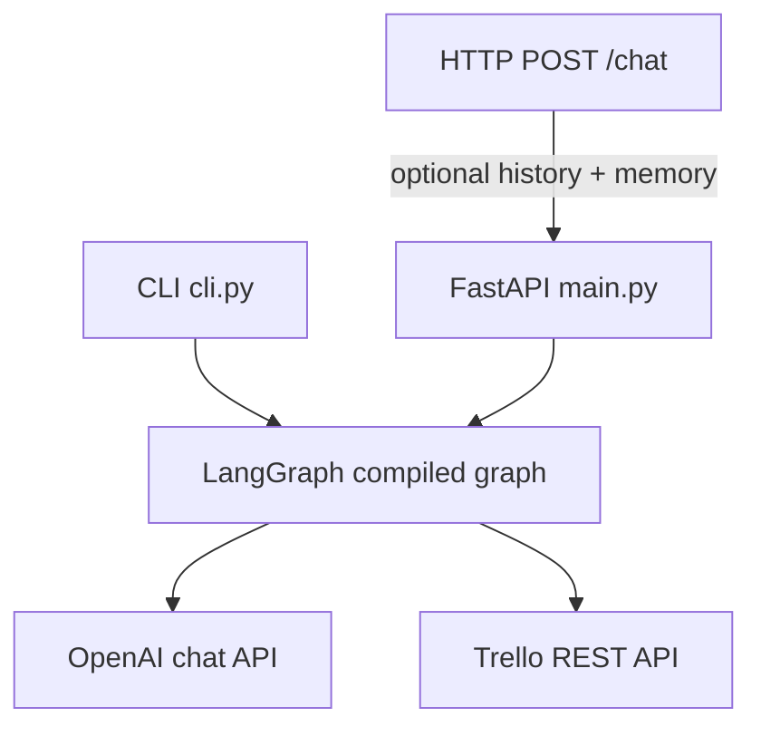
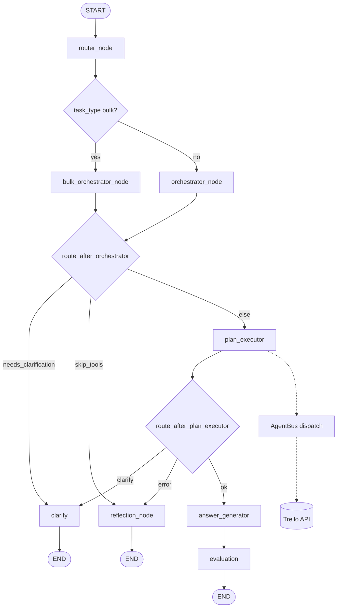

# 01 — Architecture and topology

This document describes how the Trello agent is assembled: clients, the LangGraph runtime, specialist agents, HTTP tools, and external APIs.

> **Historical note:** [`prd_v1.md`](prd_v1.md) describes an older LangGraph topology (entity resolver → tool router → tool executor). The **current** system is the **A2A** pipeline documented here and in [`../README.md`](../README.md). Prefer this doc, `02_node_flows_and_routing.md`, and [`app/core/graph.py`](../app/core/graph.py) as the source of truth.

## External topology

Requests enter through either the **HTTP API** or the **CLI**. Both call the same compiled LangGraph via `invoke_agent` in [`../app/core/graph.py`](../app/core/graph.py). Specialists perform work by calling **Trello REST API v1** through [`../app/services/trello_client.py`](../app/services/trello_client.py) and thin wrappers under [`../app/tools/`](../app/tools/).

- **`main.py`:** `POST /chat` accepts `question`, optional `history`, optional `memory`, optional correlation `id`. Returns `answer`, `intent`, `trace`, and updated `memory`.
- **`cli.py`:** REPL with in-process history and memory; invokes the same graph.

The HTTP surface is **stateless** except for the `memory` dict the client sends and receives. The CLI persists session context in memory across turns.

## Logical layers

| Layer | Location | Role |
|--------|-----------|------|
| **Graph nodes** | [`app/core/nodes/`](../app/core/nodes/) | LangGraph steps: `router`, `orchestrator`, `bulk_orchestrator`, `plan_executor`, answer, evaluation, reflection, clarify |
| **Router LLM** | [`app/core/nodes/router_node.py`](../app/core/nodes/router_node.py) | Classifies `task_type` (`simple` vs `bulk`); see [07](07_bulk_scaffold_summarize_and_done.md) |
| **Orchestration LLM** | [`app/agents/orchestrator.py`](../app/agents/orchestrator.py) | Builds or resumes a **Plan** (DAG of steps) for simple tasks; does not call Trello |
| **Bulk orchestration LLM** | [`app/core/nodes/bulk_orchestrator_node.py`](../app/core/nodes/bulk_orchestrator_node.py) | Builds plans from [`app/prompt/bulk_orchestrator.py`](../app/prompt/bulk_orchestrator.py) for bulk tasks |
| **Specialist agents** | [`app/agents/trello/`](../app/agents/trello/) | `handle(A2AMessage) -> A2AResponse`; board, list, card, `batch`, `scaffold`, etc. |
| **Agent bus** | [`app/agents/bus.py`](../app/agents/bus.py) | Registry and `dispatch` with structured `[a2a]` logging |
| **Trello tools** | [`app/tools/`](../app/tools/) | HTTP verbs and paths for Trello resources |
| **Client** | [`app/services/trello_client.py`](../app/services/trello_client.py) | Auth query params, timeouts, rate limiting, retries, HTTP trace consumption |

There is **no** monolithic entity-resolver or tool-router node in the current graph. Resolution and tool choice live inside **specialists** and **orchestrator-produced plan steps**. The **router** only chooses **which planner** (simple vs bulk) runs; it does not resolve entities.

## LangGraph topology (high level)

`route_after_orchestrator` is shared by **both** `orchestrator_node` and `bulk_orchestrator_node` ([`app/core/graph.py`](../app/core/graph.py)). **`bulk_orchestrator_node`** normally returns a plan with `skip_tools=False` and does not set `needs_clarification` (failures use `skip_tools=True` → reflection). **`orchestrator_node`** can return **`needs_clarification`** (intent ambiguity) before any plan execution.

See [02 — Node flows and routing](02_node_flows_and_routing.md) for exact routing predicates and state fields.

## Configuration surface

[`../app/core/config.py`](../app/core/config.py) loads `.env` from the `trello_agent` directory. Notable settings:

| Setting | Purpose |
|---------|---------|
| `TRELLO_API_KEY` / `TRELLO_KEY` / `TRELOO_KEY` | Trello API key (first non-empty wins) |
| `TRELLO_API_TOKEN` / `TRELLO_TOKEN` | Trello token |
| `TRELLO_BOARD_ID` | Optional default board |
| `BOARD_SCOPE_ONLY` | When `TRELLO_BOARD_ID` is set, default restricts listing to that board |
| `API_KEY` / `OPENAI_API_KEY` | OpenAI credentials |
| `MODEL` | Chat model name (default `gpt-4.1`) |
| `MAX_EVAL_RETRIES` | Evaluation retry budget (default `2`) |
| `DELETE_ITEM` | Must be `true` to allow permanent card delete via API |
| `SESSION_PREFETCH` | First-turn warm-up (`me`, boards, list map) when `true` |
| `LOG_TRELLO_FULL`, `LOG_LLM_FULL`, `LOG_MAX_BODY_CHARS` | Verbose logging and truncation |

Full setup and observability notes: [`../README.md`](../README.md).

## Related documents

- [02 — Node flows and routing](02_node_flows_and_routing.md)
- [03 — Plans, agents, and execution](03_plans_agents_and_execution.md)
- [07 — Bulk, scaffold, summarize, done](07_bulk_scaffold_summarize_and_done.md)
