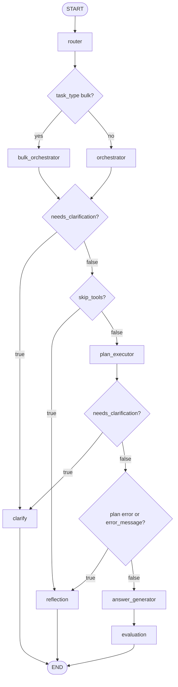

# 02 — Node flows and routing

This document matches the **wired** LangGraph in [`../app/core/graph.py`](../app/core/graph.py). Conditional routing uses `route_after_router`, `route_after_orchestrator`, `route_after_plan_executor`, and `route_after_evaluation`.

## Node inventory and edges

| Node | Type | Outgoing edges |
|------|------|----------------|
| `router` | entry | Conditional → `orchestrator` or `bulk_orchestrator` |
| `orchestrator` | planning | Same conditional as bulk orchestrator → `plan_executor`, `reflection`, or `clarify` |
| `bulk_orchestrator` | planning | Same conditional → `plan_executor`, `reflection`, or `clarify` |
| `plan_executor` | work | Conditional → `clarify`, `answer_generator`, or `reflection` |
| `answer_generator` | work | Fixed → `evaluation` |
| `evaluation` | work | Conditional → `END` (only path key `end`) |
| `reflection` | terminal | Fixed → `END` |
| `clarify` | terminal | Fixed → `END` |

Compiled structure:

1. `set_entry_point("router")`
2. `add_conditional_edges("router", route_after_router, {"orchestrator", "bulk_orchestrator"})`
3. `add_conditional_edges("orchestrator", route_after_orchestrator, {"plan_executor", "reflection", "clarify"})`
4. `add_conditional_edges("bulk_orchestrator", route_after_orchestrator, {"plan_executor", "reflection", "clarify"})`
5. `add_conditional_edges("plan_executor", route_after_plan_executor, {"clarify", "answer_generator", "reflection"})`
6. `add_edge("answer_generator", "evaluation")`
7. `add_conditional_edges("evaluation", route_after_evaluation, {"end": END})`
8. `add_edge("reflection", END)` and `add_edge("clarify", END)`

## Routing functions

### After `router`

```python
# app/core/graph.py
if (state.get("task_type") or "simple") == "bulk":
    return "bulk_orchestrator"
return "orchestrator"
```

- **`task_type`** is set by [`router_node`](../app/core/nodes/router_node.py) (LLM classification), except when `memory.pending_plan` indicates resume or destructive confirmation (router forces **`simple`** without calling the LLM). See [07 — Bulk, scaffold, summarize, done](07_bulk_scaffold_summarize_and_done.md).

### After `orchestrator` or `bulk_orchestrator`

```python
if state.get("needs_clarification"):
    return "clarify"
if state.get("skip_tools"):
    return "reflection"
return "plan_executor"
```

**Order matters:** **`needs_clarification` is checked before `skip_tools`.** Intent-level clarification is returned by **`orchestrator_node`** with `skip_tools=True` and `needs_clarification=True` ([`_intent_clarify_response`](../app/core/nodes/orchestrator_node.py)); routing sends the user to **`clarify`**, not **`reflection`**.

- **`skip_tools`** without clarification: orchestrator or bulk orchestrator failed to build a plan (exception path) → **reflection**.
- **`bulk_orchestrator_node`** on success does not set `needs_clarification`; on LLM/build failure it sets `skip_tools=True` → **reflection**.

### After `plan_executor`

```python
if state.get("needs_clarification"):
    return "clarify"
if (state.get("plan_execution_status") or "") == "error" or (state.get("error_message") or "").strip():
    return "reflection"
return "answer_generator"
```

Order matters: **clarification** wins first. Destructive confirmation and ambiguous entity flows set `needs_clarification` and attach `pending_plan_payload` (see [04 — Session memory and governance](04_session_memory_and_governance.md)).

Typical producers of these flags:

| Branch | Set by | Notes |
|--------|--------|--------|
| `clarify` | `orchestrator` | Intent ambiguity (`needs_clarification` + question) before plan execution |
| `clarify` | `plan_executor` | `needs_clarification=True`, `clarification_question`, optional `pending_plan_payload` |
| `reflection` | `plan_executor` | `plan_execution_status=="error"`, or non-empty `error_message` (and not clarifying) |
| `reflection` | `orchestrator` / `bulk_orchestrator` | `skip_tools=True` and not `needs_clarification` |
| `answer_generator` | `plan_executor` | Successful execution: `plan_execution_status=="ok"`, empty `error_message`, no clarification |

### After `evaluation`

Always returns `"end"` → graph `END`. There is no retry loop edge in the graph today; retry state is recorded in `evaluation_result` for observability.

## Decision diagram (routing only)



## `ChatState` keys relevant to routing

Defined in [`../app/core/state.py`](../app/core/state.py). The most important for edges:

| Key | Used for |
|-----|----------|
| `task_type` | Router output: `"simple"` or `"bulk"` (consumed by `route_after_router`) |
| `skip_tools` | After orchestrator(s) → reflection when not clarifying |
| `needs_clarification` | After orchestrator(s) or executor → clarify |
| `clarification_question` | User-facing question (clarify node) |
| `plan_execution_status` | e.g. `"ok"`, `"error"`, `"clarify"` |
| `error_message` | Non-empty triggers reflection when not clarifying |
| `pending_plan_payload` | Serialized plan + flags for resume (clarify / destructive confirm) |
| `plan`, `plan_trace`, `parsed_response` | Downstream answer and API trace |
| `http_status` | Evaluation success / retry / giveup |
| `evaluation_result`, `evaluation_retry_count` | Set by `evaluation` node |

## Related documents

- [01 — Architecture and topology](01_architecture_and_topology.md)
- [03 — Plans, agents, and execution](03_plans_agents_and_execution.md)
- [04 — Session memory and governance](04_session_memory_and_governance.md)
- [07 — Bulk, scaffold, summarize, done](07_bulk_scaffold_summarize_and_done.md)
