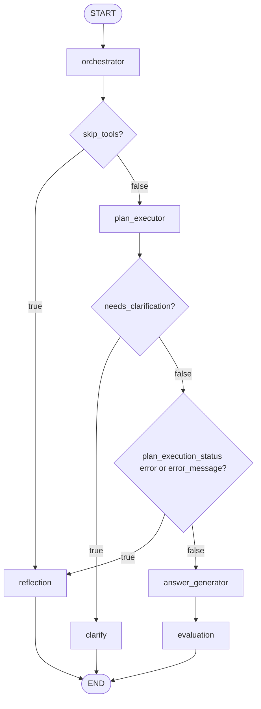

# 02 — Node flows and routing

This document matches the **wired** LangGraph in [`../app/graph.py`](../app/graph.py). Conditional routing is implemented by `route_after_orchestrator`, `route_after_plan_executor`, and `route_after_evaluation`.

## Node inventory and edges

| Node | Type | Outgoing edges |
|------|------|----------------|
| `orchestrator` | entry | Conditional → `plan_executor` or `reflection` |
| `plan_executor` | work | Conditional → `clarify`, `answer_generator`, or `reflection` |
| `answer_generator` | work | Fixed → `evaluation` |
| `evaluation` | work | Conditional → `END` (only path key `end`) |
| `reflection` | terminal | Fixed → `END` |
| `clarify` | terminal | Fixed → `END` |

Compiled structure (conceptually):

1. `set_entry_point("orchestrator")`
2. `add_conditional_edges("orchestrator", route_after_orchestrator, {"plan_executor", "reflection"})`
3. `add_conditional_edges("plan_executor", route_after_plan_executor, {"clarify", "answer_generator", "reflection"})`
4. `add_edge("answer_generator", "evaluation")`
5. `add_conditional_edges("evaluation", route_after_evaluation, {"end": END})`
6. `add_edge("reflection", END)` and `add_edge("clarify", END)`

## Routing functions

### After `orchestrator`

```python
# app/graph.py (conceptual)
if state.get("skip_tools"):
    return "reflection"
return "plan_executor"
```

- **`skip_tools`** is set when the orchestrator node catches an exception building or resuming the plan, or in other error paths that skip execution. The graph jumps to **`reflection`** so the user gets an explanation instead of executing tools.

### After `plan_executor`

```python
if state.get("needs_clarification"):
    return "clarify"
if (state.get("plan_execution_status") or "") == "error" or (state.get("error_message") or "").strip():
    return "reflection"
return "answer_generator"
```

Order matters: **clarification** wins first. Destructive confirmation and ambiguous entity flows set `needs_clarification` and attach `pending_plan_payload` (see [04 — Session memory and governance](04_session_memory_and_governance.md)).

Typical producers of these flags:

| Branch | Set by | Notes |
|--------|--------|--------|
| `clarify` | `plan_executor` | `needs_clarification=True`, `clarification_question`, optional `pending_plan_payload` |
| `reflection` | `plan_executor` | `plan_execution_status=="error"`, or non-empty `error_message` (and not clarifying) |
| `reflection` | `orchestrator` | `skip_tools=True` (before executor) |
| `answer_generator` | `plan_executor` | Successful execution: `plan_execution_status=="ok"`, empty `error_message`, no clarification |

### After `evaluation`

Always returns `"end"` → graph `END`. There is no retry loop edge in the graph today; retry state is recorded in `evaluation_result` for observability.

## Decision diagram (routing only)



## `ChatState` keys relevant to routing

Defined in [`../app/state.py`](../app/state.py). The most important for edges:

| Key | Used for |
|-----|----------|
| `skip_tools` | Orchestrator → reflection |
| `needs_clarification` | Executor → clarify |
| `clarification_question` | User-facing question (clarify node) |
| `plan_execution_status` | e.g. `"ok"`, `"error"`, `"clarify"` |
| `error_message` | Non-empty triggers reflection when not clarifying |
| `pending_plan_payload` | Serialized plan + flags for resume (clarify / destructive confirm) |
| `plan`, `plan_trace`, `parsed_response` | Downstream answer and API trace |
| `http_status` | Evaluation success / retry / giveup |
| `evaluation_result`, `evaluation_retry_count` | Set by `evaluation` node |

## Related documents

- [01 — Architecture and topology](01_architecture_and_topology.md)
- [03 — Plans, agents, and execution](03_plans_agents_and_execution.md)
- [04 — Session memory and governance](04_session_memory_and_governance.md)
