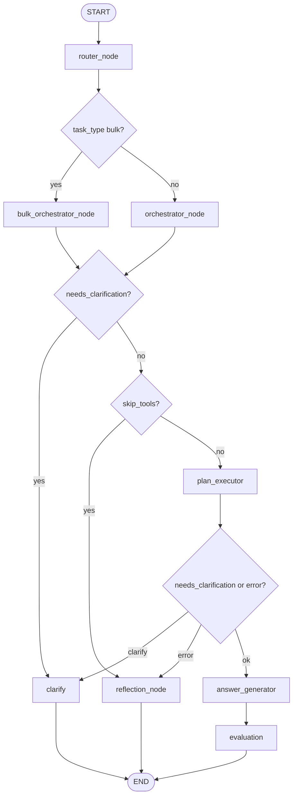

# 07 — Bulk pipeline, scaffold, board summarize, and marking done

This document describes **capabilities** that extend the core A2A plan/execute loop: routing bulk vs simple tasks, the bulk planner catalog, `batch` and `_foreach`, AI task scaffolding, board summaries, and disambiguation between “due complete” vs “move to Done list”.

For graph wiring, see [02 — Node flows and routing](02_node_flows_and_routing.md). For agent registration and plans, see [03 — Plans, agents, and execution](03_plans_agents_and_execution.md).

## Router (simple vs bulk)

**Code:** [`app/core/nodes/router_node.py`](../app/core/nodes/router_node.py)

- On each turn, the **router** node (first node after `START`) classifies the user message into `task_type`: `"simple"` or `"bulk"`.
- **Bulk** means the *same* action applies to *many* items at once (e.g. mark all cards in a list complete, archive every card on a list, create many named cards in one go).
- The router calls an LLM with structured output (`_RouteDecision`) unless a **state shortcut** applies:
  - If `memory.pending_plan` has `awaiting_destructive_confirm` → force **`simple`** (no router LLM).
  - If `memory.pending_plan` has a normal in-flight `plan` → force **`simple`** so the next message can **resume** the existing plan instead of reclassifying as bulk.
- **Empty question** → `simple`.
- On LLM failure, the router defaults to **`simple`**.

The graph then branches: `route_after_router` sends **`bulk`** turns to `bulk_orchestrator`, **`simple`** turns to `orchestrator` ([`app/core/graph.py`](../app/core/graph.py)).

## Bulk planning and execution

**Planner node:** [`app/core/nodes/bulk_orchestrator_node.py`](../app/core/nodes/bulk_orchestrator_node.py) — builds a `Plan` using [`app/prompt/bulk_orchestrator.py`](../app/prompt/bulk_orchestrator.py) (`BULK_CATALOG`, `BULK_BUILD_PLAN_*`).

**Executor:** The same [`app/core/nodes/plan_executor.py`](../app/core/nodes/plan_executor.py) runs bulk plans as simple plans. There is no second executor.

**Prefer `batch` when it fits:** The bulk catalog tells the model to use **`batch.*`** for common patterns (single plan step, iteration inside the agent). Use **`_foreach`** when you need a generic “for each item in this list, call this `agent.ask` with these literals.”

### Batch agent (`batch`)

**Code:** [`app/agents/trello/batch.py`](../app/agents/trello/batch.py) — registered on the AgentBus as `batch`.

| `ask` | Inputs (conceptual) | Behavior |
|-------|---------------------|----------|
| `mark_list_cards_complete` | `list_id` | For each open card on the list, set Trello `dueComplete` true (skips already complete). |
| `archive_list_cards` | `list_id` | For each open card, set `closed` true. |
| `create_cards` | `list_id`, `names` (JSON array of strings, or comma-separated string parsed by agent) | Creates one card per name. |
| `mark_checklist_items_complete` | `checklist_id`, `card_id`, optional `state` | All check items on one checklist → `complete` or `incomplete`. |
| `mark_card_items_complete` | `card_id`, optional `state` | All check items on **all** checklists on the card. |

Responses include aggregate `success_count` / `error_count` and capped `results` / `errors` lists.

### Pseudo-agent `_foreach`

**Not** on the AgentBus. The plan executor detects `step.agent == "_foreach"` and expands it inline:

- **`source`** (required): resolved to a **list** (e.g. from a prior step’s `cards`). If not a list, execution errors with a clear message.
- **`limit`** (optional): after resolution, only the first *N* items are processed.
- **`agent`**, **`ask`**: target specialist and operation for each item.
- **`item_id_field`** (default `"id"`): field name on each collection element to read the id from.
- **`key_as`** (default `"card_id"` when `agent == "card"`): input key name passed to the child dispatch (e.g. `card_id`).
- **`extra_inputs`**: dict merged into each dispatch; values must be **literals** (the executor does not resolve `$refs` inside this nested dict).

Each iteration dispatches `A2AMessage` with `_resolved_inputs = {key_as: iid, **extra_inputs}`. The step result aggregates success/error counts and capped lists.

## Scaffold (construction agent)

**Code:** [`app/agents/trello/scaffold.py`](../app/agents/trello/scaffold.py) — agent name `scaffold`.

| `ask` | Role |
|-------|------|
| `build_task_scaffold` | LLM generates card titles, descriptions, checklists/items, estimates, optional member assignment; creates cards on a given `list_id` from `topic` / `n_cards` / checklist hints. |
| `set_smart_due` | LLM-assisted due-date estimate for an existing card (`card_id`). |

Typical planner flows live in [`app/prompt/orchestrator.py`](../app/prompt/orchestrator.py) (e.g. resolve board → resolve list → `scaffold.build_task_scaffold`).

## Board summarize

**Code:** `board.get_board_summary` in [`app/agents/trello/board.py`](../app/agents/trello/board.py).

Natural-language triggers are described in `ORCHESTRATOR_CATALOG` / typical flows in [`app/prompt/orchestrator.py`](../app/prompt/orchestrator.py) (e.g. “summarize the board”, “board status”, “progress report”). The orchestrator should plan: `resolve_board` → `get_board_summary`.

## Marking done (due complete vs Done list)

Trello distinguishes:

- **`CARD_SET_DUE_COMPLETE`** — sets the card’s **due** badge to complete (`dueComplete`); does **not** move the card.
- **`CARD_MOVE`** — moves the card to a list (e.g. a list literally named “Done”).

**Analyzer + heuristic**

- Stage-1 analysis rules live in the analyze template in [`app/prompt/orchestrator.py`](../app/prompt/orchestrator.py).
- [`app/utils/done_intent.py`](../app/utils/done_intent.py) applies **`apply_done_intent_heuristic`** after `analyze()` in [`app/core/nodes/orchestrator_node.py`](../app/core/nodes/orchestrator_node.py): if the model mistakenly sets `needs_intent_clarification` but the user text unambiguously means mark-complete or move-to-Done, clarification is cleared and `suggested_final_intent` is corrected.

**Card name resolution**

- [`app/agents/trello/card.py`](../app/agents/trello/card.py) uses **`_card_name_matches_hint`** so short hints (e.g. `Ai`) do not spuriously match substrings inside unrelated words (e.g. `AGAIN` in `TEST_AGAIN`).

## End-to-end graph (planning fork)

## Related documents

- [01 — Architecture and topology](01_architecture_and_topology.md)
- [02 — Node flows and routing](02_node_flows_and_routing.md)
- [03 — Plans, agents, and execution](03_plans_agents_and_execution.md)
